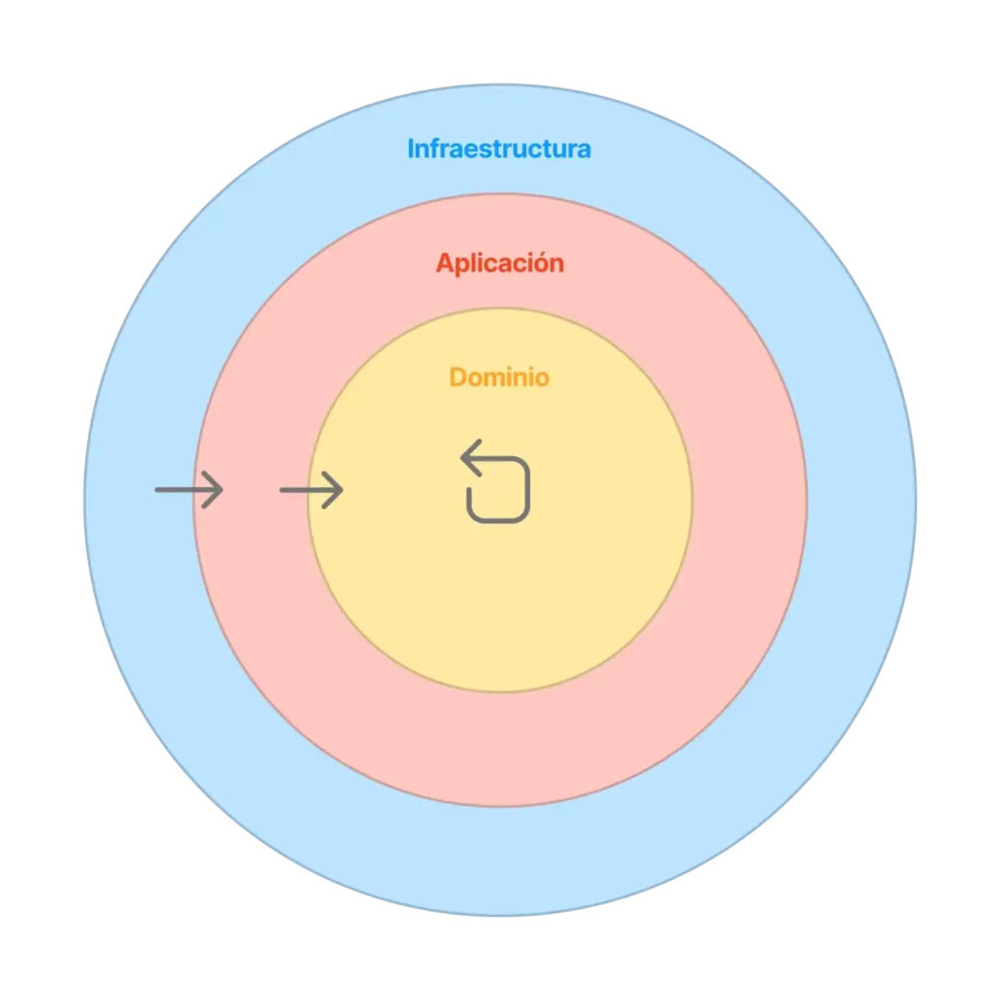
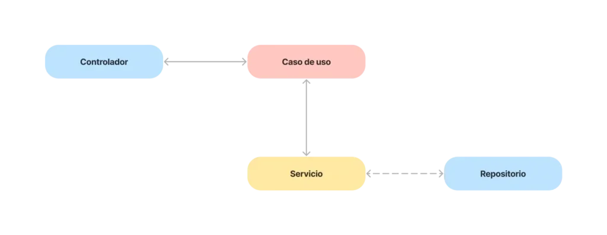

# patrones arquitectonicos
> [!NOTE]
> un **paron arquitectonico** es uan solocion general y reutilizable a un problema comun en la arquitectura  de sofware dentro de un contexto dado . los patrones arquitectonicos  son la habilidad de organisacion a nivel de carpetas  entro del proyecto de sofware .

PATRONES ARQUITECTONICOS MAS CONOCIDOS 

1. PATRON DE CAPAS 
2. PATRON CLIENTE-SERVIDOR 
3. PATRON MAESTRO-ESCLAVO
4. `PATRON FILTRO DE TUBERIA` 
5. PATRON DE INTERM EDIARIO
6. PATRON DE IGUAL A IGUAL
7. PATRON DE BUS EVENTO
8. MMODELO-VISTA-CONTROLADOR 
9. ARQUITECTURA LIMPIA
10. ARQUITECTURA EXAGONAL

># LA  **arquitectura limpia**

>[!NOTE]
>Cada uno de los círculos concéntricos representa una capa, y esta capa a su vez es una barrera que sólo puede ser atravesada por sus capas superiores. De este modo:

>Infraestructura puede acceder a Aplicación y a Dominio Aplicación puede acceder a Dominio
>Dominio sólo puede acceder a Dominio
>Cuanto más hacia dentro penetramos en las capas, más nos adentramos en la lógica de negocio, las reglas y las políticas. Cuanto más hacia fuera nos movemos, más cerca estamos de los agentes externos o mecanismos (clientes web o mobile, servicios externos o APIs, servicios de infraestructura como bases de datos, sistemas de colas, etc).

># Contenido de las capas
>Cada una de estas capas contiene distintos elementos de nuestro código, vamos a hacer un pequeño repaso al contenido de cada una de ellas:

># Dominio
>Esta es la capa más cercana al negocio, por no decir que es el negocio en sí misma. En la capa de dominio es donde residen todas las piezas fundamentales que, además, servirán como lenguaje común para comunicarse entre las otras capas. Por ejemplo:

>Entidades: modelos de datos con identidad propia, compuestos por Value Objects, que pueden ser anémicos o no.
>Value Objects: piezas fundamentales para modelar entidades o agregados. Los value objects representan elementos básicos de nuestro dominio, como pueden ser el id de un usuario, su nombre, su correo… estas diminutas clases contienen la lógica de validación de sus valores, no tienen entidad propia y se comparan por valor, como una primitiva más.
>Servicios: son pequeñas clases que ejecutan una acción, como puede ser recuperar un usuario de la base de datos, construir la entidad y devolverla o devolver un NullObject si no existe. Estos servicios se pueden usar solos o combinados en los distintos casos de uso.
>Eventos: los eventos de dominio son la forma más eficaz de comunicarse en dirección contraria a la de la regla de dependencia. Si una acción de dominio requiere disparar otro caso de uso de la capa de aplicación, será como reacción a un evento.
>Excepciones: clases que representan errores comunes que se producen en nuestra aplicación. “Usuario no encontrado”, “Dinero insuficiente”, “El valor no puede ser negativo…”, etc.
>Contratos: por contratos, claro está, nos referimos a interfaces como pueden ser UserRepository, LogReporter, ExceptionTracker… etc. Es decir, contratos que se deberán de implementar en la capa de infraestructura. Por ejemplo: UserRepositoryMySQL, SumoLogicLogReporter o SentryExceptionTracker. Estos contratos son los que nos permitirán implementar inversión de dependencias y nos darán la capacidad de cambiar estas dependencias, facilitando por ejemplo la transición de MySQL a MongoDB, ya que la interfaz 
># Aplicación
>En esta capa residirán los casos de uso, es decir, los orquestadores que, haciendo uso de elementos de dominio como entidades, excepciones, servicios, value objects… los combinan para obtener una respuesta.

>Aquí se pueden aplicar patrones como CQS y CQRS o simplemente casos de uso más simples.

># Infraestructura
>Aquí tenemos implementaciones de los distintos contratos que ha definido dominio. Esta es la capa que más puede variar su código a la hora de portar nuestro proyecto de un framework a otro o al cambiar de provider de base de datos o al cambiar una librería third party por otra.

>Ejemplo de un flujo de aplicación
>Veamos un ejemplo del flow de un endpoint:

>Flujo de aplicacion
>Flujo de aplicación con correspondencia de cada capa
>En esta imagen podemos apreciar algunos de los componentes que intervienen en la ejecución de un endpoint, y he asociado cada color al de la capa que pertenece.

>## Controlador:
> aquí puede haber discrepancias y, en muchos casos, hay quien considera los controladores como parte de la capa de aplicación. Teóricamente es correcto, pero en la práctica nos encontramos con muchos frameworks que impiden que el controlador sea un elemento desacoplado, ya que tiene que heredar de ciertas clases para poder funcionar correctamente, así que en este ejemplo el controlador formará parte de la capa de infraestructura y lo consideraremos parte del framework.
>Su misión en este caso es simplemente extraer los datos de la request, encapsular los datos en un DTO y pasárselo al caso de uso para que lo maneje. Una vez reciba la respuesta, se encargará de elegir la presentación adecuada y devolver la respuesta.
>## Caso de uso:
> esta es la parte de nuestro código que coordina la ejecución de la lógica de negocio. Puede incluir validaciones de los datos de entrada y la coordinación de distintos servicios de dominio para obtener la respuesta deseada, así como lanzar excepciones si se produce un error (esperado o inesperado).
>## Servicio.
> Aquí es donde vive la lógica de nuestra aplicación, donde se ejecutan las políticas que hemos definido y donde reside todo el conocimiento.
>Como se puede apreciar, los servicios de dominio pueden requerir del uso de elementos de infraestructura, pero nunca de forma directa, ya que hacemos uso de la inversión de dependencias para lograrlo.
>Implementaciones conocidas de Clean Architectures
>Ahora que ya sabes un poco más sobre arquitecturas limpias puede que te pique la curiosidad y quieras implementarla en tus proyectos. ¿Por dónde deberías empezar?